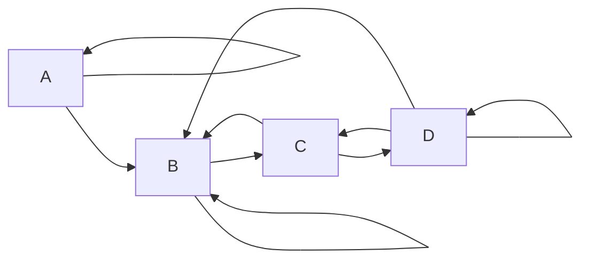
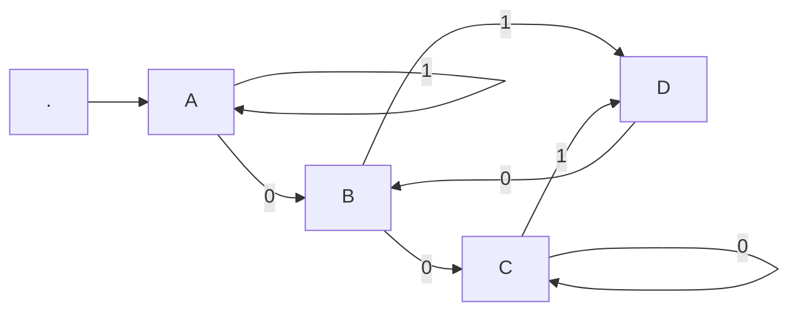

# Exercice 1

# Exercice 2

|     | P    | Q    | R    |
| --- | ---- | ---- | ---- |
| ->$S_{1}$  | $\{S_{1}S_{3}\}$ | $\{S_{1}\}$    |      |
| $S_{2}$  |      | $\{S_{2}S_{3}\}$ | $\{S_{1}S_{2}$ |
| $S_{3}$  |      |   $S_{2}$   |      |

|                       | P                | Q                | R                |
| --------------------- | ---------------- | ---------------- | ---------------- |
| ->$\{S_{1}\}$         | $\{S_{1}S_{3}\}$ | $\{S_{1}\}$      |                  |
| $\{S_{1}S_{3}\}$      |                  | $\{S_{2}S_{3}\}$ |                  |
| $\{S_{1}S_{2}\}$      |                  | $S_{2}$          | $\{S_{1}S_{2}\}$ |
| $\{S_{1}S_{2}S_{3}\}$ | $S_{1}S_{3}$     |                  |                  | $\{S_{1}S_{2}\}$

# Exercice 3
|       | 0         | 1       |
| ----- | --------- | ------- |
| ->$p$ | $\{p,q\}$ | $\{p\}$ |
| $q$   | $\{r\}$   | $\{r\}$ |
| r     | $\{s\}$   | $\emptyset$        |
| $*s$  | $\{s\}$   | $\{s\}$        |

|               | 0         | 1     |
| ------------- | --------- | ----- |
| $\{p\}$       | $p,q$     | $p$   |
| $\{p,q\}$     | $p,q,r$   | $p,r$ |
| $\{p,q,r\}$   | $p,q,r,s$ | $p,r$ |
| $\{q,r\}$     | $pqs$         | $p$     |
| $\{p,q,s\}$        |  $p,q,r,s$         |   $p,r,s$    |
| $\{p,q,r,s\}$ |     $pqrs$      |       |
// A remplacer

# Exercice 4

|        | 0           | 1           |
| ------ | ----------- | ----------- |
| -> $p$ | $\{p,q\}$   | $\{p\}$     |
| $q$    | $\{r,s\}$   | $\{t\}$     |
| r      | $\{p,r\}$   | t           |
| $*s$   | $\emptyset$ | $\emptyset$ |
| $*t$   | $\emptyset$ | $\emptyset$ |

-->

|           | 0    | 1   |
| --------- | ---- | --- |
| ->$\{p\}$ | $pq$ | $p$ |
| $pq$        | $pqrs$ | $pt$  |
| $*pqrs$      | $pqrs$ | $pt$  |
| $*pt$        | $pq$   | $p$    |

# Exercice 5
|       | $\epsilon$  | a       | b           | c           |
| ----- | ----------- | ------- | ----------- | ----------- |
| ->$p$ | $\emptyset$ | $\{p\}$ | $\{q\}$     | $\{r\}$     |
| q     | $\{p\}$     | $\{q\}$ | $\{r\}$     | $\emptyset$ |
| $*r$  | $\{q\}$     | $\{r\}$ | $\emptyset$ | $\{p\}$            |

1. 
$F^\epsilon(p)=\{p\}$
$F^\epsilon(q) = \{q,p\}$
$F^\epsilon(r) = \{pqr\}$
2. 

|        | a     | b           | c       |
| ------ | ----- | ----------- | ------- |
| ->$p$  | $p$   | $pq$        | $pqr$   |
| pq     | $pq$  | $pqr$       | $pqr$   |
| $*pqr$ | $pqr$ | $pqr$ | $pqr$ |

