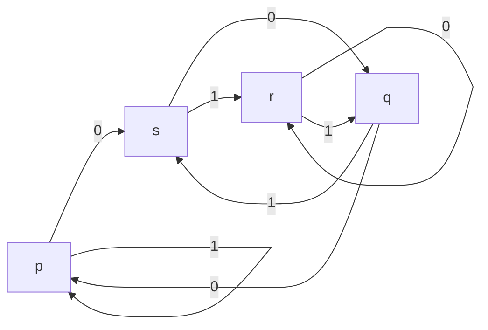
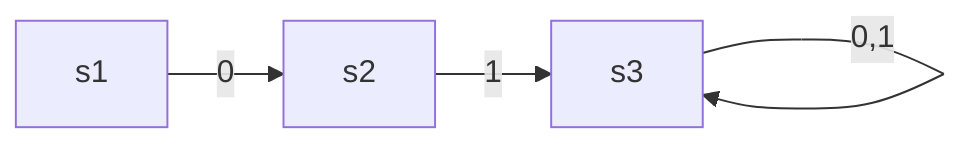
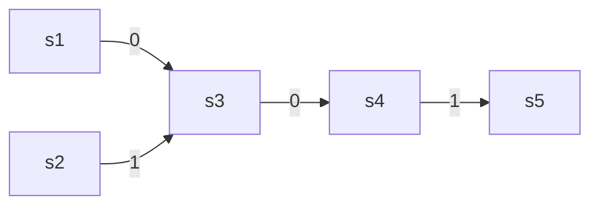
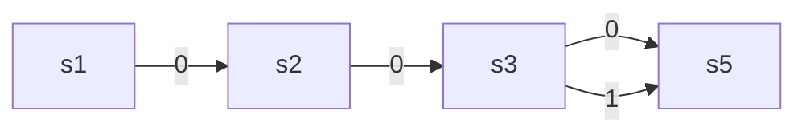

---
~
---
# Exercice 1
1. Vrai
2. Faux
3. ?
4. ?
5. Faux
(Voir page 75)

# Exercice 2
(à partir de la page 80)
1. Expression régulière pour $R_{i:j}^{(0)}$
$$R_{i:j}^{(0)}$$
$$= R_{1:1}=\epsilon+1$$   
2. Expression régulière pour $R_{i:j}^{(1)}$
3. Expression régulière pour $R_{i:j}^{(2)}$
4. Expression régulière du langage de cet automate par construire $R_{1:3}^{(3)}$ 
5. Expression régulière du langage de cet automate par éliminer $q_{2}$

# Exercice 3
On convertit cet automate

|       | 0   | 1   |
| ----- | --- | --- |
| ->\*p | s   | p   |
| q     | p   | s   |
| r     | r   | q   |
| s     | q   | r   |

Par cette expression régulière :

Sa forme REGEX est : 
# Exercice 4
On convertit ces expressions régulières en AFD :
1. 01*

   
2. (0+1)01

3. 00(0+1)

# Exercice 5

# Exercice 6
