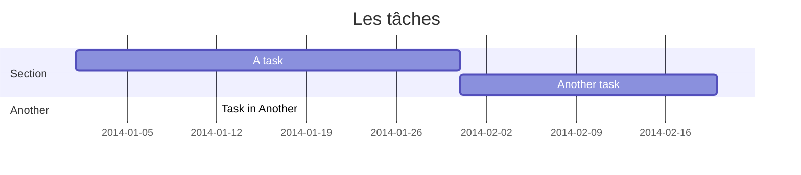

| Tâche | Durée en semaine | Préalable |
| ----- | ---------------- | --------- |
| A     | 3                | -         |
| B     | 5                | A         |
| C     | 7                | B,G       |
| D     | 4                |           |
| E     | 3                | D         |
| F     | 2                | E,G       |
| G     | 8                | A,D,H     |
| H     | 12               |           |
| I     | 15               | H         |
| J     | 4                | I         |
| K     | 7                | L,M       |
| L     | 5                | C,F       |
| M     | 9                | J,N       |
| N     | 2                | G,I       |

