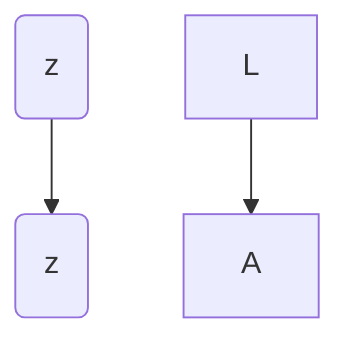
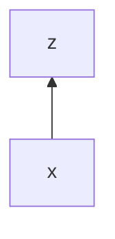
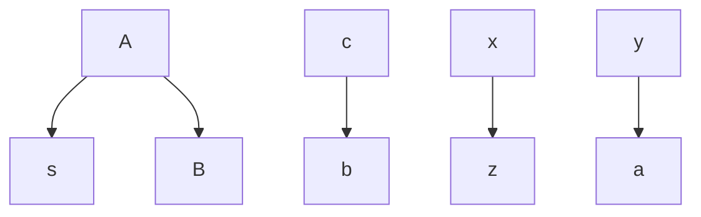
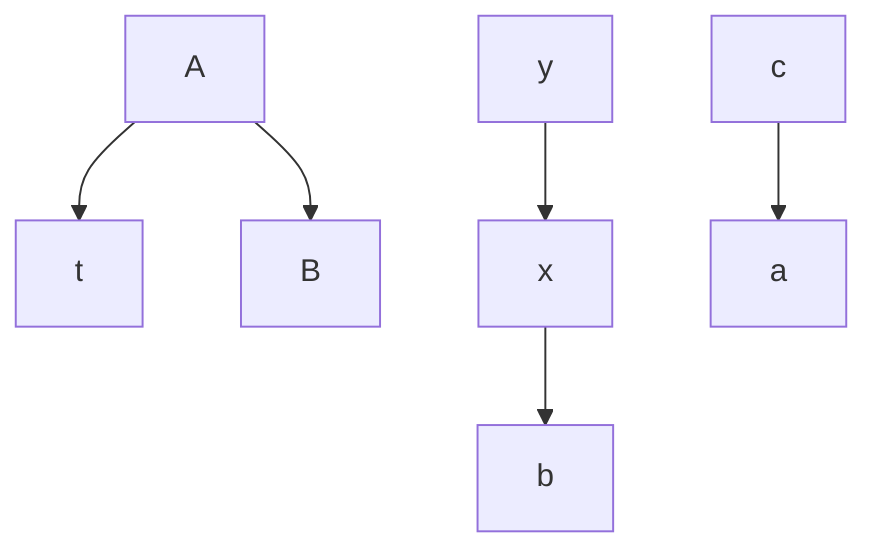
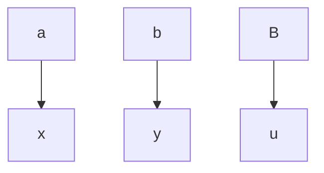
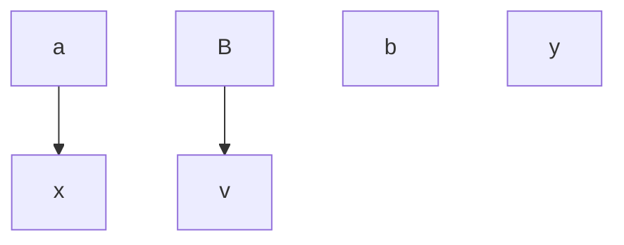
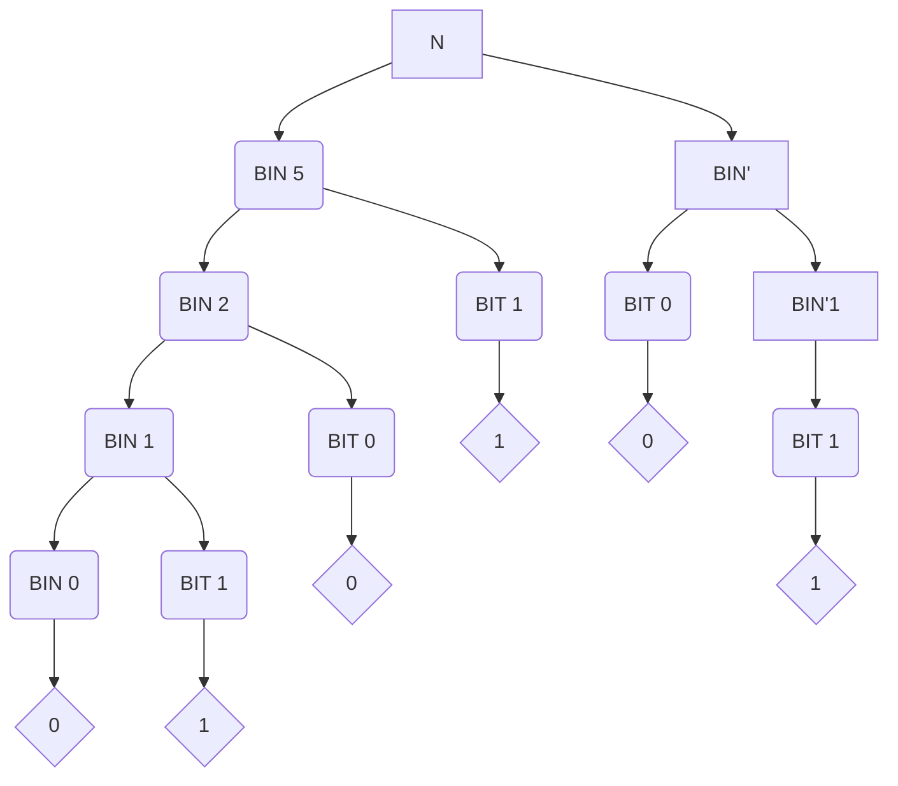
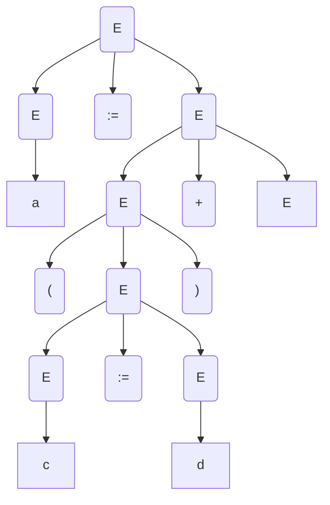
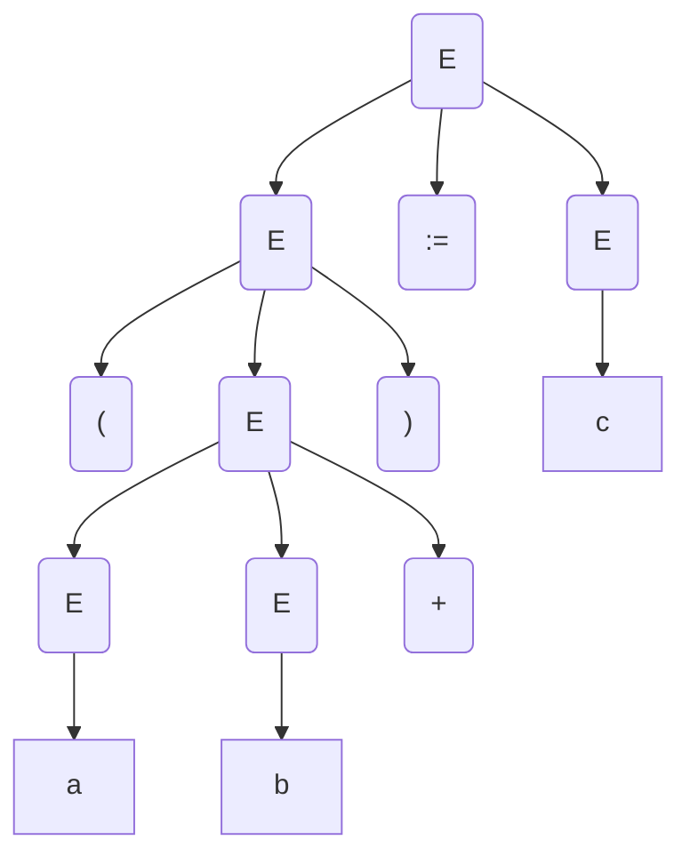
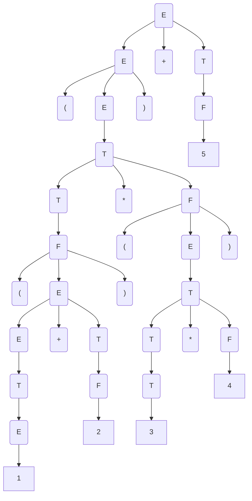

# Exercice 1

Soit la grammaire $\text{Exercice}_{1}$ suivante : $NT = \{L, A, B\}$ et $T = \{s, t, u, v\}$
__Attribues synthétisés__ :
- $z$, avec $L,A$
- $x, y$ avec $B$
__Attribues hérités__ :
- $c$ avec $A$
- $a, b$ avec $B$

|     .      | .                                     |
| :--------: | ------------------------------------- |
| $L \to A$  | $\{L.z = A.z, A.c = 0\}$              |
| $A \to sB$ | $\{B.a = B.y, B.b = A.c, A.z = B.x\}$ |
| $A \to tB$ | $\{B.a = A.c, B.b = B.x, A.z = B.y\}$ |
| $B \to u$  | $\{B.x = B.a, B.y = B.b\}$            |
| $B \to v$  | $\{B.x = B.a, B.y = 0\}$              |

1. 

2. ![[Drawing 2024-09-20 11.36.08.excalidraw||1500px]]
3. $A.c=0$
   $B.b = A.c = 0$
   $B.a = B.y$
   $B.x = B.a$

# Exercice 2

$$N \to BIN.BIN'$$
$$BIN \to BIN ~ BIT \{BIN_{0}~v = 2 \times BIN_{1}~v+BIT.v\}$$
$$BIN \to \epsilon \{BIN.v=0\}$$$$BIN'\to BIT ~ BIN' ~~~ \{BIN'_{0}~v=\frac{BIT.v+BIN'_{1}.v}{2}\}$$
$$BIN'\to BIT~~\{BIT.v=0\}$$
$$BIT \to 0 ~~ \{BIT.v=0\}$$$$BIT \to 1 ~~ \{BIT.v=1\}$$
$v$ : attribut synthétisé, associé à $N, BIN, BIN', BIT$
$v \in \mathbb{R}$

# Exercice 3 

Soit la grammaire suivante : 

$$
\begin{cases}
S \to E \\
E \to E := E ~ | ~ E+E ~ | ~ (E) ~ | ~ id
\end{cases}
$$

Vrai :

Faux :

>[!info]
>côté: attribut hérité $\in \{gauche, droite, \bot\}$ associé à $E$
>bf : attribut synthétisé $\in \{true, false\}$  associé à $S,E$

$$S \to
\{cote(E)= \bot \} ~~ E$$
$$E \to \{ cote(E_{1}) = cote(E), cote(E_{2}) = cote(E) \}$$
$$E_{1} + E_{2}$$
$$\begin{cases}
\text{Si } cote(E) = \text{ gauche alors} \\
bf(E)= \text{ false} \\
\text{Sinon } bf(E) = bf(E_{1}) ~ \& ~ bf(E_{2})
\end{cases}$$
$$E \to \{cote(E_{1}) = \text{ gauche}, cote(E_{2}) = \text{ droite}\}$$
$$E_{1} := E_{2} \{bf(E) = bf(E_{1}) ~\& ~ bf(E_{1}) \}$$
$$E \to \{cote(E_{1}), cote(E)\}(E_{1})\{E ~ bf = (E \text{ cote } \neq \text{gauche}) \}$$
$$E \to id ~ \{E.bf= tau\}$$

# Exercice 4

1. 

2. Soit le texte $(((1+2) * (3 * 4)) + 5)$
   $(((1+2)*(3*4)) + 5) \to (1+2)* ~~~~ 3 * 4 ~~~~ +5$
   $E \to E_{1}+T$
   $\{E.poids=1, E.\exp = E_{1}.\exp \land '+' \land T.\exp\}$
$E\to E_{1}-T$
$\{ E.poids = 1, \text{ si } T.poids=1 \text{ alors } E_{1}.\exp \land '-' \land '(' \land T.\exp ')'$
$\text{sinon } E.\exp = E_{1}.\exp \land '-' \land T.\exp \}$

$E\to T \{ E.poids = T.poids ; E.\exp = T.\exp \}$
$T \to T_{1} \times F \{ T.poids = 2,$
$T.\exp = \text{ si } T_{1}.poids=1 \text{ alors } '(' \land T_{1}.\exp \land ')' \text{ sinon } T_{1}.\exp f \text{ FIN DU si }$ 
$\land '*'$
$\land \text{ si } F.poids = 1 \text{ alors } '(' \land F.\exp \land ')' \text{ sinon } F.\exp \text{ FIN DU si}$
