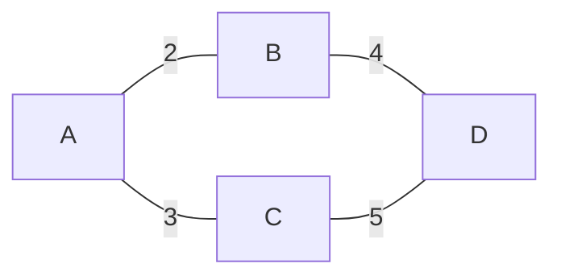
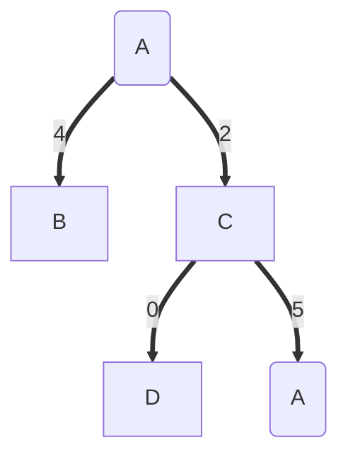
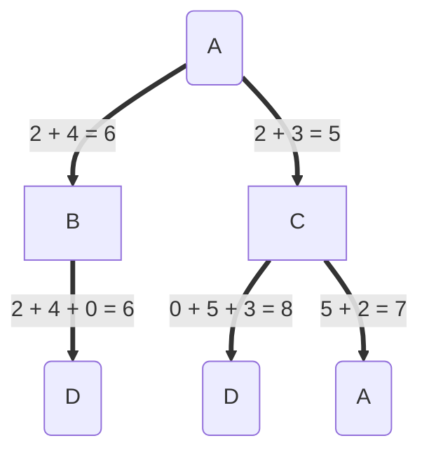
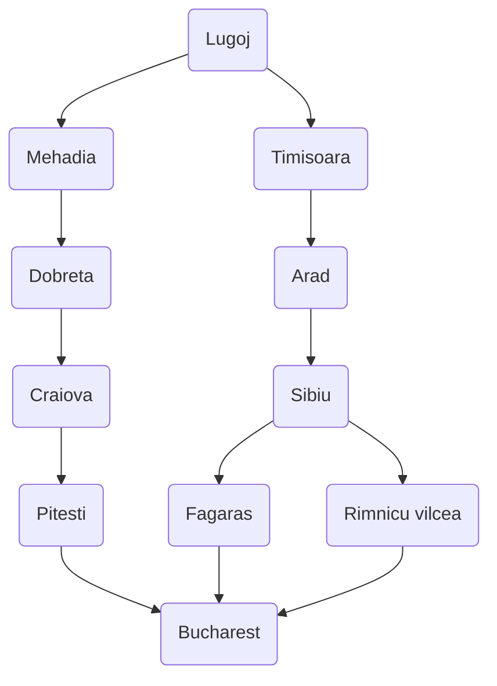
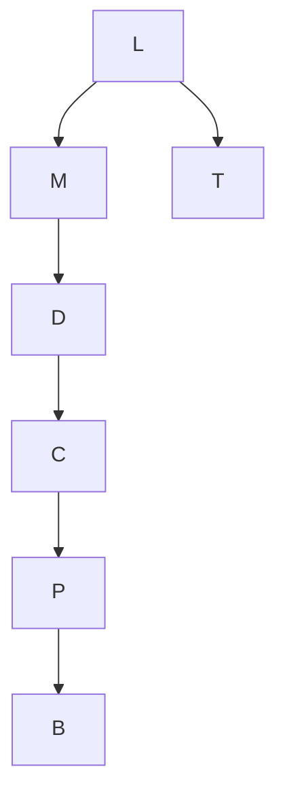

# Exercice 1

Pour aller de $A$ à $D$, avec l'heuristique $A(5), ~ B(4), ~ C(2), ~ D(0)$

## Recherche gloutonne

## A*

$f(n)=g(n)+h(n)$

|              Ouvert              |    Clos     |
| :------------------------------: | :---------: |
|            $A_{0+5}$             |  $A_{[]}$   |
|       $B_{2+4} ~~ C_{3+2}$       |  $C_{[A]}$  |
| $B_{6} ~ \cancel{A} ~ D_{3+5+0}$ |  $B_{[A]}$  |
| $\cancel{D_{3+5+0}} ~ D_{2+4+0}$ | $D_{[ABD]}$ |

# Exercice 2

## Recherche gloutonne

|                     Ouvert                      | Clos |
| :---------------------------------------------: | :--- |
|                    $L_{244}$                    | $L$  |
|              $T_{329} ~ ~ M_{241}$              | $M$  |
|        $T_{329} ~ ~ D_{242} \cancel{L}$         | $D$  |
|        $T_{329} ~ ~ C_{160} \cancel{M}$         | $C$  |
| $T_{329} ~ ~ RV_{193} ~~ P_{100} ~~ \cancel{D}$ | $P$  |
|  $T_{329} ~ ~ D_{242} ~~ B_{0} ~~ \cancel{C}$   | $B$  |
|                                                 |      |
## A*

|                           Ouvert                           | Clos      |
| :--------------------------------------------------------: | :-------- |
|                       $L_{0 + 244}$                        | $L_{0}$   |
|              $T_{111 + 329} ~ ~ M_{70 + 241}$              | $M_{70}$  |
|      $T_{111 + 329} ~ ~ D_{70 + 75 +242} \cancel{L}$       | $D_{145}$ |
|   $T_{111 + 329} ~ ~ C_{70 + 75 + 120 + 160} \cancel{M}$   | $C_{265}$ |
| $T_{111 + 329} ~~ RV_{265+146+193} ~~  P_{} ~~ \cancel{D}$ | $T_{111}$ |
|           $A_{111+151+366} ~~ RV_{265+146+193}$            | $P_{403}$ |
|                                                            | $B_{504}$ |

# Exercice 3

1. 1 flèche = 1 booléen
   Espace d'état : $[a,b,c,d,e,f]$ avec $a,b,c,d,e,f \in \{0,1\}$
   État initial : $[0,0,0,1,0,1]$
   État final : $[1,1,1,1,1,1]$
   $h(n) = 6 - somme(etat) / 2$
   Nombre de O adjacents, si paire compter $1$ pour le bloc
   
   Simplification 1 -- $\frac{\text{Nombre de flèche vers le bas}}{2}$
	   - 2
	   - ~~adjacent~~ 
   Simplification 2 -- $\text{Nombre de blocs vers le bas}$
	   - ~~2~~
	   - adjacent
2. . 
	1. Heuristique 1 : flèche mal orientée
		4 flèches mal orientées
		
	2. Heuristique 2 : paire mal orientée
3. L'action consiste à retourner deux flèches adjacentes
4. 
# Exercice 4

Soit la fonction $f(n)=(2-w)g(n)+wh(n)$

|   $W$   | Algo optimal  | Fonction        |
| :-----: | :-----------: | --------------- |
| $W = 1$ |      A*       | $g(n) + h(n)$   |
| $W = 2$ |    glouton    | $2 \times h(n)$ |
| $W = 0$ | cout uniforme | $2 \times g(n)$ |
# Exercice 5

|      Algorithme      | Fonction               |
| :------------------- | ---------------------- |
|  Recherche largeur   | $f(n) = g(n)$          |
| Recherche profondeur | $f(n)= -g(n)$          |
|      Gloutonne       | $f(n) = 2 \times h(n)$ |
|          A*          | $f(n) = g(n) + h(n)$   |

# Exercice 6

1. L'heuristique pour ce problème est 