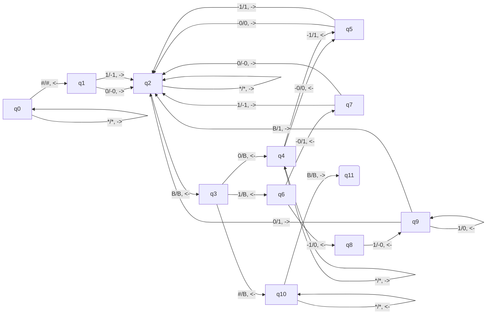

# Exercice 1

1. XXXX
2. On cherche une $\text{MT}$ avec $\sum=\{ a,b,c \}$ reconnaissant $\sum*aba\sum*$ : 
3. On cherche une $\text{MT}$ reconnaissant $\{ 0^k 1^k, k \in \mathbb{N} \}$ avec $\sum=\{ 0, 1 \}$ :
4. On cherche une $\text{MT}$ reconnaissant $\{ a^{2^k}, k \in \mathbb{N} \}$ avec $\sum=\{ a \}$ :

# Exercice 2

1. La fonction calculée par la $\text{MT}$ est XXX
2. Soit une $\text{MT}$ calculant $n \mapsto n+1$ avec $\sum=\{ 0,1 \}$ en interprétant un mot sur $\sum$ comme un entier XXXXXXX

# Exercice 3

1. .
2. $\epsilon, a, ababb,ab,abab$ (?)
3. .
4. .

# Exercice 4

1. .
2. .
3. .

# JSP où ça se met

Soit $1011\#110$, on doit pouvoir faire une MT telle que nous ayons $u\#v$ où $u$ et $v$ sont en binaires, avec $\#$ pour séparer les deux

4. Soit $M$ une $\text{MT}$ telle qui reconnait $L$
   On construit $M'$ qui calcule $f$ en partant de $M$ 
	   - On normalise $M$
	   - On ajoute 2 branches
6. 

|                  | $L_{0}$ rec $L_{1}$ rec | $L_{0}$ rec $L_{1}$ non rec | $L_{0}$ non rec $L_{1}$ rec | $L_{0}$ non rec $L_{1}$ non rec |
| :--------------: | -------------------------- | ------------------------------ | ------------------------------ | ---------------------------------- |
|   $L$ récursif   | $\mathbb{N}$               | X                              | X                              | X                                  |
| $L$ non récursif | X                          | $L'_{\text{pas rec}}$          | $L'_{\text{pas rec}}$          | ?                                  |

On suppose $L_{\text{???}} \subseteq \mathbb{N}$ non récursif
On pose $L'_{\text{pas rec}} = \{ 2\times n, n \in L_{\text{pas rec}} \}$
Par l'absurde, si $L_{\text{pas rec}}'$ est récursif, il existe une $\text{MT } M'$ totale qui le réc???
On construit $M$ qui sur l'entrée $u$ :
- Ajoute $0$ à la fin de $u$
- Revient au début
- ??? $M'$
$M$ est totale et reconnait $L_{\text{pas rec}}$ donc $L_{\text{pas rec}}$ est récursif : **faux**.
