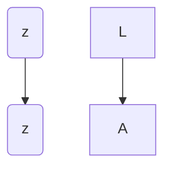
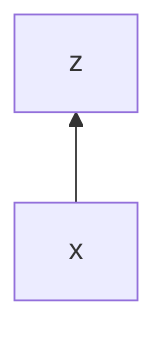
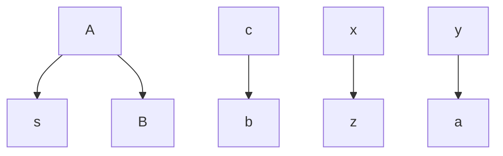
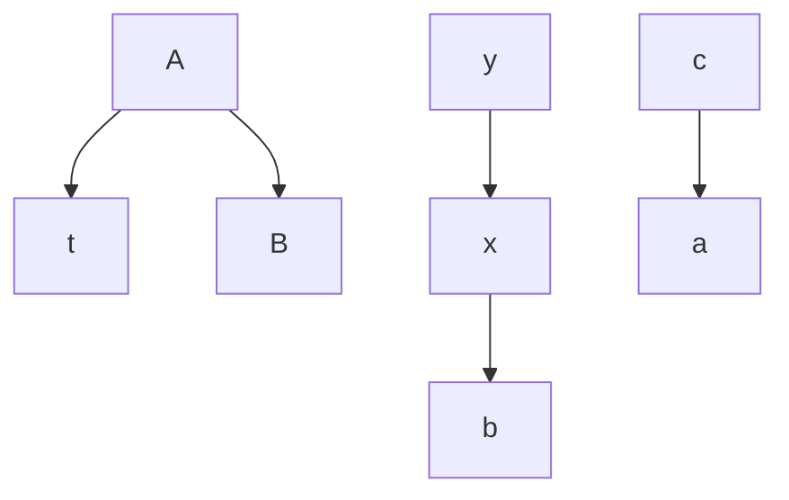
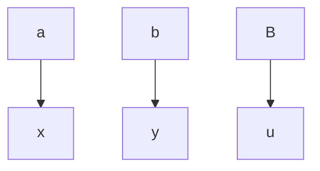
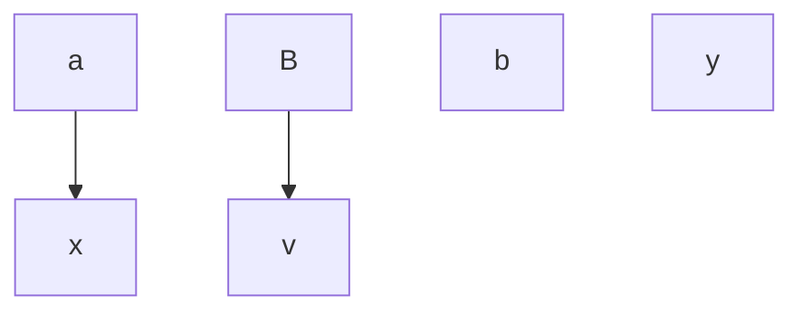

# Exercice 1

Soit la grammaire $\text{Exercice}_{1}$ suivante : $NT = \{L, A, B\}$ et $T = \{s, t, u, v\}$
__Attribues synthétisés__ :
- $z$, avec $L,A$
- $x, y$ avec $B$
__Attribues hérités__ :
- $c$ avec $A$
- $a, b$ avec $B$

|     .      | .                                     |
| :--------: | ------------------------------------- |
| $L \to A$  | $\{L.z = A.z, A.c = 0\}$              |
| $A \to sB$ | $\{B.a = B.y, B.b = A.c, A.z = B.x\}$ |
| $A \to tB$ | $\{B.a = A.c, B.b = B.x, A.z = B.y\}$ |
| $B \to u$  | $\{B.x = B.a, B.y = B.b\}$            |
| $B \to v$  | $\{B.x = B.a, B.y = 0\}$              |

1. 

2. ![[Drawing 2024-09-20 11.36.08.excalidraw||1500px]]
3. $A.c=0$
   $B.b = A.c = 0$
   $B.a = B.y$
   $B.x = B.a$