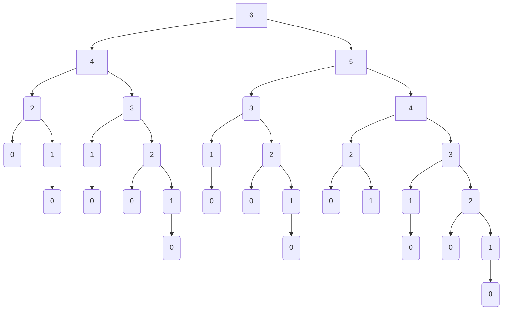

# Exercice 1

1. .
2. .

# Exercice 2

1. Soit $6$ allumettes au départ, nous avons en espace des mouvements possibles :

2. Chacun son tour
3. Voir photo


# Exercice 4

```python
def valeur_max_ab(etat, a, b):
	return {etat, XXX}

def valeur_min_ab(etat, a, b):
	return

def rech_ab(etat):
	# On utilise valeur_max_ab ?
	return

def demarrer(): 
```

