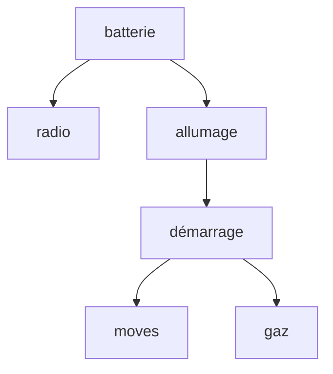

# Exercice 1

$\underset{\text{corps}}{[1~~1]} \to \underset{\text{tete}}{[~~]}$

1. $\text{farine } \land \text{ beurre } \land \text{ oeufs } \land \text{ sel}\to \text{pâte}$
   $\text{pomme } \land \text{ sucre} \to \text{pomme\_sucrée}$
   $\text{pâte } \land \text{ pomme\_sucrées}\to \text{tarte\_aux\_pommes}$
   $\text{pâte } \land \text{ abricots}\to \text{tarte\_aux\_abricots}$
   $\text{pâte } \land \text{ poires} \to \text{tarte\_aux\_poires}$
   $\text{pâte } \land \text{ cerises} \to \text{tarte\_à\_la\_cerise}$
2. 
	1. Chaînage avant jusqu'à saturation
	```mermaid
	flowchart TB
	pate ---> farine
	pate ---> beurre
	pate ---> oeufs
	pate ---> sel
	```
	
2. Chaînage arrière
	```mermaid
	   flowchart TB
	   tarte_abricots --> pate
	   tarte_abricots --> abricots
	   pate --> farine
	   pate --> beurre
	   pate --> oeufs
	   pate --> sel
	```

# Exercice 2

Soit une base de connaissance $B$, la fonction $\text{TELL}(B, \alpha)$ pour ajouter une connaissance $\alpha$ dans $B$ et la fonction $ASK(B, \alpha)$ qui répond vrai ou faux pour vérifier si $\alpha$ est déductible à partir de $B$.
Pour faire la fonction $\text{ASK}$, on utilise le chaînage avant ou arrière:

1. $\{\text{pâte}: \big[ [\text{farine, beurre, oeufs, sel}], [\text{farine, beurre, sucre}]\big]\}$
2. $B:\big\{\text{`faits'}~~  [~~~~] ~~ \text{`règles'} ~~ \{t_{1}v_{1}, \dots, t_{n}v_{n}\}\big\}$
   $\left\{ \underset{\text{pâte}}{t_{1}} : \big[ \underset{\text{recette de pâte}}{v_{11}, \dots, v_{1m}]}, \dots, \underset{\text{1 autre recette de pâte}}{[v_{\sigma_{1}}, \dots, v_{\sigma p}]} \big] \right\}$

3. On peut proposer ce qui suit
	1. .
	   ```python
# Chainage avant
def ASK(B, a):
	iteration = True
	while(iteration):
		if a in B.faits return True
		for regle in B.regles:
			for r in regle:
				for ingredient in r:
					if ingredient is in B.faits: break
				TELL(B, regle)
				iteration = True
```
	2. .
```python
# Chainage arrière
def ASK(B, a):
	if a in B.faits return True
	if a not in B.regles return False
	for recipe in B.regles.a:
		for ingredient in recipe:
			if not ASK(B, ingredient) return False
		return True
```

4. 
   ```python
   def ASK(B, a):
	   if a in B return True
	   if a in B.regles
		   X = B.regle.a ?????
		   for x in X:
			   return ??
		   ?????
```
5. 
```python
def TELL(B,a)
```

# Exercice 3

1. $I\to B$, $R\to B$, $S \to I \land G$, $M\to S$
   $\underset{1}{\underline{A}} \land (\underline{B} \lor A) \land (A \lor \underline{\lnot B})$
   
>[!error] Exercice non corrigé


# Exercice 4


1. $B\to \text{batterie}$
   $R \to \text{radio}$
   $A \to \text{allumage}$
   $D \to \text{démarrage}$
   $M\to \text{moves}$
   $G\to \text{gaz}$
2. 

|  B  |  R  | $B\to R$ | $R\to B$ |
| :-: | :-: | :------: | :------- |
|  0  |  0  |    1     | 1        |
|  0  |  1  |    1     | 0        |
|  1  |  0  |    0     | 1        |
|  1  |  1  |    1     | 1        |

3. $R \to B$ I $->$ B S $->$ I S $->$ G M $->$ S
   $\lnot$ S $\lnot$ R $\lor$ B $\lnot$ I $\lor$ B $\lnot$ S $\lor$ I $\lnot$ S $\lor$ G $\lnot$ M $\lor$ S
   
![[Drawing 2024-11-14 11.18.15.excalidraw]]

![[Drawing 2024-11-14 11.18.45.excalidraw]]