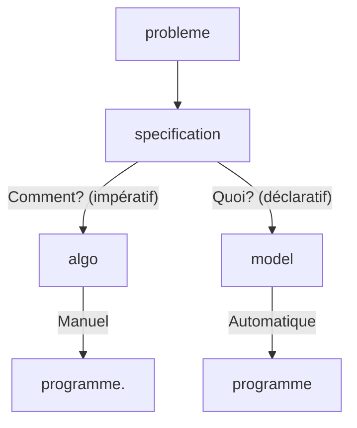

2 approches :
- IA symbolique (top-down)
- IA numérique (bottom-up)
# IA symbolique & numérique

- IA symbolique
	- Problème sur des problèmes de __recherches__ ou de __raisonnements__.
	- Problème pouvant être résolu par des règles logiques ou heuristiques

- IA numérique
	- La machine apprend le meilleur paramètre par rapport aux datas
	- __Classification supervisée__ : elle apprend des règles de décisions permettant de réagir correctement quand une nouvelle situation arrive
		- Avec des exemples positifs et négatifs (conduite normale / conduite dangereuse)
	- __Classification non supervisée__ (ou clustering) : entrainement sous des données sans tag (positif ou négatif).
# Programmation par contrainte

La programmation par contrainte offre des méthodes & technique pour résoudre des problèmes combinatoire:
- Modélisation des problèmes en CSP ou COP sur des langages haut niveau
- Résout les problèmes CSP/COP en utilisant l'inférence, appelé propagation par contrainte, et une méthode de recherche.

## Déclaratif vs impératif

