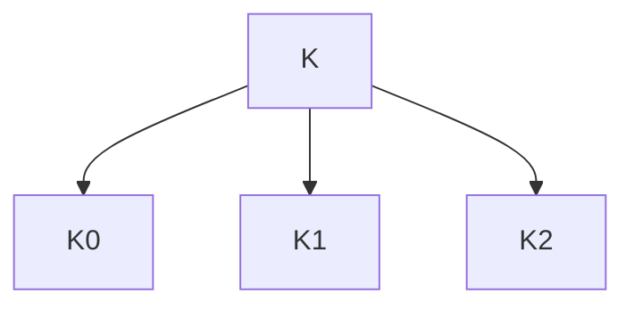

# Exercice 1

Dans cet exercice, les messages sont constitués d'une suite d'entiers codés sur 4 bits et noté en hexadécimal. Chaque caractère est codé en ASCII par deux entiers successifs. Ainsi le mot ``CAKE`` est ``43414B45``. Les tables en annexe permettent d'adapter l'algo Mini AES vu en cours à la notation hexadécimal.

1. Chiffrer le message ``Ok`` avec la clé ``cafe``
	- $\text{O}\to \text{4F}$
	- $\text{k}\to \text{6B}$
	- Donc le message est $\text{4F6B}$
2. Déchiffrer le message ``3140`` avec la clé ``1664``
	- .
	- .

>[!info] 
>Correction du tableau, je ne sais pas à quel exercice

$$K_{0}=\left(\begin{matrix}
k_{0} & c & k_{2} \\
k_{1} & \alpha & k_{3}
\end{matrix}\right)$$
$$K_{1} = \left(\begin{matrix}
k_{4} & k_{6} \\
k_{5} & k_{7}
\end{matrix}\right)$$
$$K_{2}=\left(\begin{matrix}
k_{8} & k_{10}\\
k_{9} & k_{11}
\end{matrix}\right)$$
$$K_{1}=\left(\begin{matrix}
k_{4}=\upvarphi(k_{5}\oplus k_{?}\oplus 1) & k_{6}=k_{2}\oplus k_{5} \\
k_{5}=k_{1} \oplus k_{4} & k_{7}=k_{3}\oplus k_{6}
\end{matrix}\right)=\left(\begin{matrix}
o \oplus c \oplus 1 = \alpha & f \oplus 7 = 8 \\
a \oplus d = 7 & e \oplus 8 = 6
\end{matrix}\right) = \left(\begin{matrix}
\alpha & 8 \\
7  &  6
\end{matrix}\right)$$
$$K_{2}=\left(\begin{matrix}
k_{8}=\upvarphi(k_{2}) \oplus k_{4} \oplus 2 & k_{10}=k_{6} \oplus k_{?} \\
k_{?}=k_{5} \oplus k_{8} & k_{11}=k_{7}\oplus k_{10}
\end{matrix}\right)=\left(\begin{matrix}
b \oplus d \oplus 2=4 & 8 \oplus 3 = b \\
7 \oplus 4 = 3 & 6 \oplus b = d
\end{matrix}\right)=\left(\begin{matrix}
4 & b \\
3 & d
\end{matrix}\right)$$

