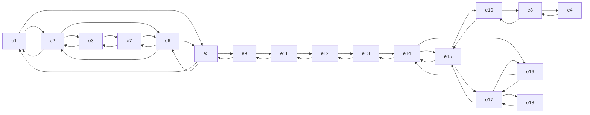

# Modélisation

## Les états de ce monde

L'ensemble des positions possibles dans le schéma $x,y \in \mathbb{R}^2 |x \in [0,4],y \in [0,5] \setminus(a,b) \text{ (où } (a,b) \text{ est la position des blocs grisés)}$

## L'état initial

L'état initial est $(0,0)$.

## L'état final

L'état final est $(4,5)$ (où $e_{18}$)

## Les actions

gauche, droite, haut, bas, selon l'état $$
\begin{align}

& \text{ACTION}(e_{1})=\{ \rightarrow, \downarrow \} \\
&\text{ACTION}(e_{2})=\{ \leftarrow, \rightarrow, \downarrow \} \\
&\vdots \\
& \text{ACTION}(e_{17})= \{ \leftarrow, \downarrow \} \\
& \text{ACTION}(e_{18})= \{ \uparrow \}
\end{align}$$
## Modèle de transition (graphe)

# Résolution

## Quelle mesure représente $f(n)$ ?

$f(n)$ représente le coût du plus court chemin reliant le départ au but et qui prolonge $n$
## Est-elle admissible ? Pourquoi ?

.$f$ est admissible.

## Dérouler l'algo en construisant l'arbre de recherche

| noeud    | $\Delta x$ | $\Delta y$ | $h(n)$                  |
| -------- | ---------- | ---------- | ----------------------- |
| $e_{1}$  | 4          | 5          | $41 \leftarrow 4^2+5^2$ |
| $e_2$    | 3          | 5          | $34 \leftarrow 3^2+5^2$ |
| $\vdots$ | $\vdots$   | $\vdots$   | $\vdots$                |
| $e_{18}$ | 0          | 0          | 0                       |

## Dérouler l’algorithme en représentant sa trace sous la forme d’un tableau contenant au moins : le nœud développé, son prédécesseur, $g(n)$, $h(n)$, $f(n)$, l’état du nœud

| noeud    | prédécesseur | $g(n)$ | $h(n)$ | $f(n)$ | état |
| -------- | ------------ | ------ | ------ | ------ | ---- |
| $e_{1}$  |              |        |        |        |      |
| $e_2$    |              |        |        |        |      |
|          |              |        |        |        |      |
| $e_{18}$ |              |        |        |        |      |
